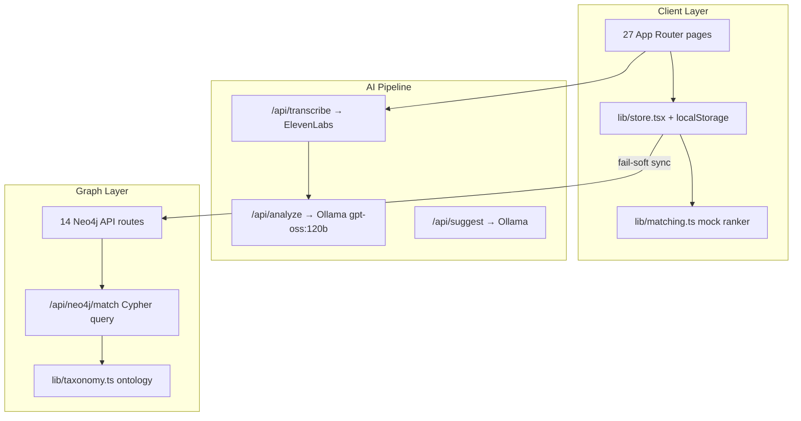
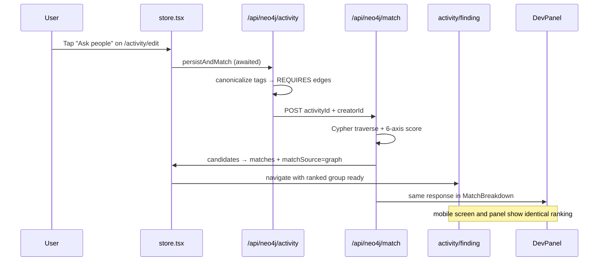
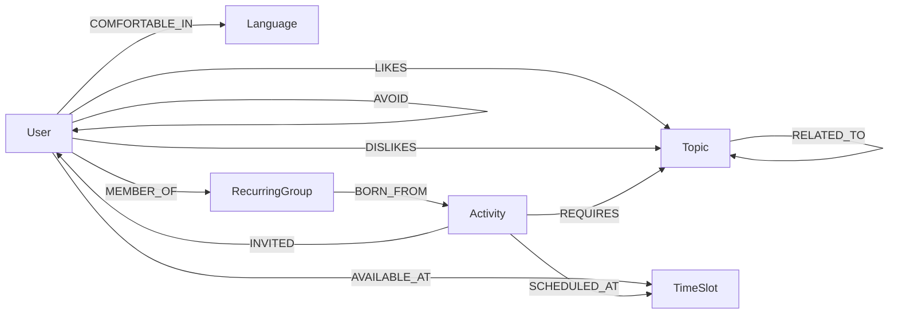

# HOMING — Project Architecture

Technical reference for the HOMING hackathon prototype: how the system works end-to-end, with deep coverage of graph matching, operational status, known gaps, and improvement recommendations.

**Related docs:** [DEMO.md](../DEMO.md) (presenter playbook) · `/theory` route (user-facing explainer)

---

## Table of Contents

1. [Executive Summary](#1-executive-summary)
2. [User Journey & Route Map](#2-user-journey--route-map)
3. [State Management](#3-state-management)
4. [AI Pipeline](#4-ai-pipeline)
5. [Graph Matching (Deep Dive)](#5-graph-matching-deep-dive)
6. [Neo4j API Reference](#6-neo4j-api-reference)
7. [Dev Tooling](#7-dev-tooling)
8. [Process Status Matrix](#8-process-status-matrix)
9. [Known Gaps & Bugs](#9-known-gaps--bugs)
10. [Improvement Recommendations](#10-improvement-recommendations)
11. [Environment & Setup](#11-environment--setup)
12. [File Index](#12-file-index)

---

## 1. Executive Summary

### What HOMING Is

**HOMING** is a voice-first social activity app prototype built for **Erasmus University Rotterdam (EUR) students aged 18–29**. The tagline is *"Activity first. Profile never."*

The product helps young adults turn spoken interests into small, low-pressure real-life activities in Rotterdam, then quietly invites matched people — no swiping, no public profiles, no popularity scores. The mascot is **Homi**, a homing pigeon.

Core principles:

- Voice onboarding → atomic interest topics → grounded activity suggestions
- Users edit the **activity**, never pick people
- Matching on interests, availability, language, commitment, mutual feedback, and avoid-pairings
- Verification before reveal (iDIN / ID+selfie — simulated in prototype)
- Private post-activity feedback; recurring groups only from mutual positive feedback
- Privacy posture: no loneliness inference, no surveillance, aggregate-only operator dashboard

### Tech Stack

| Layer | Technology |
|-------|------------|
| Framework | Next.js 15 (App Router), React 19 |
| Language | TypeScript 5.7 |
| Styling | Tailwind CSS v4, custom design tokens in `app/globals.css` |
| Icons | lucide-react |
| Speech-to-text | ElevenLabs Scribe v1 (server proxy) |
| LLM | Ollama Cloud (`gpt-oss:120b`) via OpenAI-compatible API |
| Graph DB | Neo4j AuraDB (`neo4j-driver`) |
| Graph visualization | `@neo4j-nvl/react` (dev panel only) |
| Client state | React Context + `localStorage` (`homing-demo-v1`) |
| Runtime | Node.js API routes (`runtime = "nodejs"`) |

### Three-Layer Architecture

HOMING is not a monolithic backend service. It is a **Next.js demo app** with three cooperating layers:



**Key architectural insight:** The user-facing UI runs primarily on **localStorage and a mock matcher** over 12 seed users. The Neo4j graph layer is production-shaped and fully implemented, but its match results are currently consumed only by the **dev panel** — not by the main finding/invite screens. See [Section 5](#5-graph-matching-deep-dive) for details.

---

## 2. User Journey & Route Map

### Primary Flow

```
/ → /signup → /signup/details → /voice → /transcribing → /themes
  → /suggestions → /activity/edit → /activity/finding → /activity/verify
  → /activity/details → /chat → /feedback → /feedback/result → /group
```

### Stage-by-Stage Reference

| Stage | Route | Key file | Backend calls |
|-------|-------|----------|---------------|
| Landing | `/` | `app/page.tsx` | — |
| Signup | `/signup`, `/signup/details` | `app/signup/page.tsx`, `app/signup/details/page.tsx` | `POST /api/neo4j/user` (debounced 600ms) |
| Voice | `/voice` | `app/voice/page.tsx` | Audio → `lib/audioStash.ts` (in-memory) |
| Transcribe | `/transcribing` | `app/transcribing/page.tsx` | `POST /api/transcribe`, `POST /api/analyze` |
| Topics | `/themes`, `/themes/full` | `app/themes/page.tsx` | `POST /api/neo4j/interests`, `POST /api/suggest` |
| Suggestions | `/suggestions` | `app/suggestions/page.tsx` | Background Neo4j activity sync |
| Activity edit | `/activity/edit` | `app/activity/edit/page.tsx` | `simulateInvites()` → mock match + Neo4j |
| Finding | `/activity/finding` | `app/activity/finding/page.tsx` | **Mock match only** (UI); Neo4j match fire-and-forget |
| Verify | `/activity/verify` | `app/activity/verify/page.tsx` | `POST /api/neo4j/verify` (simulated) |
| Details | `/activity/details` | `app/activity/details/page.tsx` | — |
| Chat | `/chat` | `app/chat/page.tsx` | Local state + scripted replies |
| Feedback | `/feedback`, `/feedback/result` | `app/feedback/page.tsx` | `POST /api/neo4j/feedback` |
| Group | `/group` | `app/group/page.tsx` | `POST /api/neo4j/group` |
| Reminder | `/reminder` | `app/reminder/page.tsx` | — |

### Parallel / Meta Routes

| Route | Purpose |
|-------|---------|
| `/invite`, `/invite/reschedule` | Invitee perspective (fuzzy location, no names) |
| `/demo` | Demo navigator — jump to any screen, reset localStorage |
| `/memory` | "Matching memory" UI (static, not wired to graph) |
| `/privacy`, `/safety` | Policy and support resources |
| `/dashboard`, `/metrics` | Operator views (static mock data) |
| `/theory` | Long-form architecture and ethics explainer |
| `/how-it-works` | User-facing product explanation |

### Three Demo Paths

The app supports three ways to reach `/themes` without requiring a live mic + API keys:

1. **Live recording** — User records on `/voice` → `/transcribing?live=1` → ElevenLabs transcribe → Ollama analyze
2. **Sample recording** — Pre-loaded transcript/topics via `loadSampleVoice()` or `?sample=1` URL flag
3. **Random archetype** — Pre-built transcript variants from `lib/archetypes.ts`; skips LLM entirely

### End-to-End Data Flow

```mermaid
flowchart TD
  A[Signup form] -->|debounced 600ms| B[POST /api/neo4j/user]
  C[Voice recording] -->|Blob in memory| D[/transcribing?live=1]
  D --> E[POST /api/transcribe]
  E -->|ElevenLabs| F[Transcript text]
  F --> G[POST /api/analyze]
  G -->|Ollama gpt-oss:120b| H[Topics + activities JSON]
  F --> I[keyword fallback via voiceTopics.ts]
  H --> J[/themes]
  I --> J
  J -->|background| K[POST /api/suggest]
  K --> L[3 refreshed activity cards]
  L --> M[/suggestions → /activity/edit]
  M --> N[POST /api/neo4j/activity]
  N --> O[POST /api/neo4j/match fire-and-forget]
  N --> P[GET /api/neo4j/graph]
  M --> Q[simulateInvites]
  Q --> R[POST /api/neo4j/invites + PATCH]
  Q --> S[Client rankCandidatesForActivity - seedUsers]
  S --> T[/activity/finding UI animation]
  T --> U[/activity/verify - simulated]
  U --> V[POST /api/neo4j/verify]
  V --> W[/activity/details → /chat]
  W --> X[/feedback]
  X --> Y[POST /api/neo4j/feedback]
  Y --> Z[/group]
  Z --> AA[POST /api/neo4j/group]
```

---

## 3. State Management

### Central Hub: `lib/store.tsx`

All application state flows through `AppProvider`, a React context that:

- Holds signup, transcript, topics, activities, invites, verification, and feedback
- Persists to **`localStorage`** under key `homing-demo-v1`
- Debounces and mirrors state changes to Neo4j via `lib/neo4jClient.ts`

#### State Shape

```typescript
interface State {
  signup: Signup;           // Identity, postcode, languages, availability, commitment
  transcript: string;
  topics: Topic[];
  minorInterests: string[];
  activityTypes: string[];
  suggestedActivities: Activity[];
  activity: Activity;       // Currently selected/edited activity
  inviteResponses: Record<string, "pending" | "accepted" | "declined" | "rescheduled">;
  verified: string[];
  feedback: { activityRating?, eventNote?, people: Record<string, "again" | "neutral" | "avoid"> };
}
```

#### User ID Resolution (`lib/currentUser.ts`)

Every Neo4j sync uses a resolved user context:

| Mode | ID | Detection |
|------|-----|-----------|
| Demo | `u_demo` | No email, `?sample=1` flag, or sample voice loaded |
| Live | `u_<email-slug>` | Email captured on signup (e.g. `anna@eur.nl` → `u_anna`) |

Demo-tagged nodes carry `demo: true` and can be wiped via `POST /api/neo4j/demo-clear`.

#### Neo4j Sync Effects (Fail-Soft)

| Client state change | API call | Debounce |
|---------------------|----------|----------|
| Signup fields | `POST /api/neo4j/user` | 600ms |
| Transcript | `POST /api/neo4j/voice` | Immediate |
| Topics | `POST /api/neo4j/interests` | 400ms |
| Suggested/edited activities | `persistAndMatch()` → activity + match + graph | On change |
| Invites, verify, feedback, group | Respective neo4j routes | On action |

**Fail-soft policy** (`lib/neo4jClient.ts`): All sync functions wrap fetch calls in empty `catch {}` blocks. The UI never blocks on graph failures — demos work even when Neo4j is down.

#### Matching in Store

```typescript
// lib/store.tsx — UI-facing matches use MOCK ranker
const matches = useMemo(
  () => rankCandidatesForActivity(state.activity),
  [state.activity],
);
```

`simulateInvites()` also uses `rankCandidatesForActivity()` to pick the top 4 candidates, then writes `INVITED` edges to Neo4j after `persistAndMatch()` completes.

---

## 4. AI Pipeline

All AI routes require environment variables. Without them, live recording fails; fallbacks exist for analysis only.

### 4.1 Transcription — `POST /api/transcribe`

**File:** `app/api/transcribe/route.ts`

| | |
|---|---|
| **Input** | `multipart/form-data` with `audio` blob |
| **Output** | `{ text: string, language: string }` |
| **External service** | ElevenLabs Scribe v1 (`/v1/speech-to-text`) |
| **Requires** | `ELEVENLABS_API_KEY` |
| **Failure mode** | Hard error on `/transcribing` — no fallback for live path |
| **Max duration** | 60s |

The browser records audio on `/voice`, stashes it in `lib/audioStash.ts` (session-scoped, not persisted), and uploads it on `/transcribing`.

### 4.2 Analysis — `POST /api/analyze`

**File:** `app/api/analyze/route.ts`

| | |
|---|---|
| **Input** | `{ transcript: string, demoMode?: boolean }` |
| **Output** | Topics (3–8 atomic concepts), minor interests, languages, activity types, up to 4 activity suggestions |
| **External service** | Ollama Cloud, model `gpt-oss:120b`, JSON mode |
| **Requires** | `OLLAMA_API_KEY`; optional `LLM_BASE_URL` (default `https://ollama.com/v1`) |
| **Fallback** | `lib/voiceTopics.ts` keyword extractor runs client-side if analyze fails |
| **Max duration** | 60s |

The system prompt enforces: one atomic concept per topic, never invent interests, grounded Rotterdam activities.

Response is coerced via `coerce()` / `coerceActivities()` — max lengths, defaults, type clamping.

### 4.3 Suggestion Regeneration — `POST /api/suggest`

**File:** `app/api/suggest/route.ts`

| | |
|---|---|
| **Input** | `{ topics, languages?, availability_hints?, minor_interests? }` |
| **Output** | Exactly 3 activity suggestions |
| **Trigger** | User edits topics on `/themes` |
| **Cache** | `lib/suggestionsCache.ts` — keyed by topic signature hash |
| **Requires** | `OLLAMA_API_KEY` |

Cache hit returns synchronously without an LLM call. Cache miss triggers a fresh generation with the same JSON-only prompt as analyze.

### 4.4 Fallback Chain

```
Live recording
  → ElevenLabs transcribe (required)
  → Ollama analyze (required for rich output)
  → voiceTopics.ts keyword fallback (if analyze fails)

Sample recording / archetype
  → Skip transcribe + analyze entirely
  → Pre-built topics from lib/data.ts or lib/archetypes.ts
```

---

## 5. Graph Matching (Deep Dive)

Graph matching is the most sophisticated subsystem in HOMING. It uses **symbolic graph traversal and weighted scoring** — not embeddings, vectors, or NetworkX. Every match has a traceable reason path.

### 5.1 Graph-First With Mock Fallback

HOMING runs the Neo4j graph match as the primary ranker and keeps the local mock only as a fail-soft fallback when the graph is unreachable.

| Aspect | Graph (`app/api/neo4j/match/route.ts`) | Mock fallback (`lib/matching.ts`) |
|--------|----------------------------------------|-----------------------------------|
| **Data source** | Live Neo4j graph | 12 static seed users in `lib/data.ts` |
| **Interest logic** | Canonical topic IDs + 1-hop `:RELATED_TO` | Substring `includes` on raw strings |
| **Used by** | `/activity/finding`, invites, details, chat, feedback, dev panel | Only when `/api/neo4j/match` returns null |
| **Exclusions** | `:AVOID`, `:DISLIKES` (David seeded) | Hardcoded `u_david` board-game dislike |
| **Preference bonus** | +10 via `:PREFERS_PERSON` | Not implemented |
| **Explainability** | Graph paths ("Likes Strategy games (related to Catan)") | Generic reasons ("Mentioned catan") |

#### How It Is Wired

`lib/store.tsx` holds `matches`, `matchSource` (`graph` / `mock` / `loading`), and `matchLoading` as state. `refreshMatches()` and `simulateInvites()` both call `persistAndMatch()` in `lib/neo4jClient.ts`, which awaits the real `/api/neo4j/match` response and returns the candidates:

```typescript
const graphCandidates = await persistAndMatch(activity);
const ranked = resolveMatchesForActivity(activity, graphCandidates);
setMatches(ranked);
setMatchSource(graphCandidates !== null ? "graph" : "mock");
```

`resolveMatchesForActivity()` (`lib/matching.ts`) prefers the graph candidates and only falls back to `rankCandidatesForActivity()` when the graph response is `null`. The "Ask people" button on `/activity/edit` awaits `simulateInvites()` before navigating, so `/activity/finding` opens with the ranked group already in hand. The dev panel `MatchBreakdown` reads the same `/api/neo4j/match` response, so the mobile screen and the panel always agree.

The accepted invitees (graph-ranked) are exposed as `acceptedInvitees` from the store and drive the `/activity/details`, `/chat`, and `/feedback` screens, replacing the previously hardcoded participant list.

### 5.2 Match Pipeline Sequence



### 5.3 Neo4j Graph Schema

#### Node Labels

| Label | Key Properties | Matching Role |
|-------|----------------|---------------|
| `User` | `id`, `first_name`, `neighbourhood`, `commitment_appetite`, `verification_status` | Candidate |
| `Activity` | `id`, `creator_user_id`, `day`, `time`, `location_area`, `language`, `status` | Query anchor |
| `Topic` | `id`, `title`, `canonical`, `tier` | Interest ontology |
| `TimeSlot` | `id` (`thursday-evening`, `every-weekend`, etc.) | Availability |
| `Language` | `id` (lowercase name) | Language comfort |
| `VoiceProfile` | `id`, `transcript`, `source` | Voice onboarding record |
| `RecurringGroup` | `id`, `name`, `status` | Post-feedback groups |

#### Relationship Types

| Edge | Direction | Properties | Matching Role |
|------|-----------|------------|---------------|
| `REQUIRES` | Activity → Topic | `tier`: `specific` \| `broader` | What activity needs |
| `LIKES` | User → Topic | `weight`, `source` | User interests |
| `DISLIKES` | User → Topic | — | Hard exclusion (specific tier) |
| `RELATED_TO` | Topic → Topic | `kind`, `weight` | 1-hop ontology expansion |
| `AVAILABLE_AT` | User → TimeSlot | — | User availability |
| `SCHEDULED_AT` | Activity → TimeSlot | — | Derived from day/time |
| `COMFORTABLE_IN` | User → Language | — | Language bonus |
| `PREFERS_PERSON` | User → User | `strength`, `count` | +10 preference bonus |
| `AVOID` | User → User | `since`, `activity_id` | Hard exclusion |
| `INVITED` | Activity → User | `status`, `responded_at` | Post-match invite flow |
| `RATED` | User → Activity | `rating`, `event_note` | Feedback |
| `VERIFIED_VIA` | User → Activity | `method`, `verified_at` | Verification gate |
| `MEMBER_OF` | User → RecurringGroup | — | Group membership |
| `BORN_FROM` | RecurringGroup → Activity | — | Group origin |
| `RECORDED` | User → VoiceProfile | `recorded_at` | Voice profile link |
| `SPEAKS` | User → Language | — | Languages spoken |

#### Graph Schema Diagram



### 5.4 Topic Ontology & Canonicalization

**File:** `lib/taxonomy.ts`

The taxonomy is the single source of truth for:

- Which Topic IDs are "real" (vs LLM-emitted noise)
- How interests relate to each other (graph expansion)
- How free-text neighbourhood labels collapse onto Rotterdam areas

#### Design Choice

Hand-curated, not LLM-built: deterministic, debuggable, zero runtime cost. ~30 interest clusters fit in a flat file. Comments note promotion to LLM ontology at ~200 topics.

#### Canonical Topics

~30 topics organized in clusters:

- **Games:** `games`, `board-games`, `strategy-games`, `casual-games`, `catan`, `ticket-to-ride`, `chess`
- **Movement/outdoors:** `fitness`, `running`, `gym`, `football`, `outdoors`, `walking`, `weekend-walks`, `rotterdam-walks`
- **Photography & creative:** `photography`, `architecture`, etc.
- **Social/food:** `coffee`, `study-cafes`, `cooking`, etc.

Each topic has optional `parents`, `siblings`, and `adjacent` arrays defining `:RELATED_TO` edges.

#### Edge Weights

```typescript
export const EDGE_WEIGHT: Record<TopicEdgeKind, number> = {
  broader: 0.6,   // Catan → board-games
  sibling: 0.5,   // board-games ↔ strategy-games
  adjacent: 0.3,  // photography ↔ walking
};
```

#### Canonicalization

`canonicalizeTopic(raw: string)` maps LLM output → stable graph IDs:

1. Normalize: lowercase, trim, collapse whitespace
2. Check alias map (`TOPIC_ALIASES`) — e.g. `"board game"` → `"board-games"`
3. Fuzzy neighbourhood match for location tags
4. Return `{ id, title, canonical: boolean }` — unknown topics land as `canonical: false`

Seeded into Neo4j via `lib/neo4j-ontology.ts` (`POST /api/neo4j/ontology` or during seed).

### 5.5 Cypher Match Algorithm (Step-by-Step)

**File:** `app/api/neo4j/match/route.ts`

The match query implements a two-layer matching strategy documented in code comments:

#### Layer 1: Direct Overlap

User `:LIKES` a Topic that the Activity `:REQUIRES`. Weight = 1.0, full points (50 specific / 30 broader).

#### Layer 2: One-Hop Ontology Expansion

User `:LIKES` a Topic that is `:RELATED_TO` a required Topic. Weight = edge weight (0.6 broader / 0.5 sibling / 0.3 adjacent).

#### Algorithm Steps

**Step 1 — Candidate discovery**

```cypher
MATCH (a:Activity {id: $activityId})-[req:REQUIRES]->(t:Topic)
MATCH (t)-[rel:RELATED_TO*0..1]-(t2:Topic)<-[:LIKES]-(u:User)
WHERE u.id <> $creatorId
  AND NOT (u)-[:AVOID]->(:User {id: $creatorId})
  AND NOT (:User {id: $creatorId})-[:AVOID]->(u)
  AND NOT EXISTS {
    MATCH (a)-[:REQUIRES {tier:'specific'}]->(:Topic)<-[:DISLIKES]-(u)
  }
```

Traverse 0 or 1 hop along undirected `RELATED_TO` from each required topic to find users who like related topics.

**Step 2 — Path weighting**

- Direct like (0 hops): weight = **1.0**
- 1-hop ontology edge: weight = edge's `RELATED_TO.weight` (fallback 0.4)

**Step 3 — Per-requirement max**

For each `(user, required_topic)` pair, keep the **strongest path only**. A user who likes both the exact topic and a neighbour does not get double-counted.

**Step 4 — Interest score aggregation**

Sum across all requirements:

- `specific tier`: `best_weight × 50`
- `broader tier`: `best_weight × 30`

**Step 5 — Side-axis bonuses**

| Axis | Points | Logic |
|------|--------|-------|
| Availability | +25 | Overlap includes `thursday-evening` |
| Availability | +22 | Overlap includes `every-weekend` or `friday-morning` |
| Availability | +18 | Overlap includes `weekday-evenings` |
| Availability | +10 | User has `flexible` slot |
| Availability | −15 | No overlap |
| Language | +15 | User `COMFORTABLE_IN` activity language |
| Language | −10 | No language match |
| Commitment | +6 | `try-once` or `maybe-weekly` |
| Location | +4 | `u.neighbourhood = a.location_area` |
| Preference | +10 | Creator `PREFERS_PERSON` → user |

**Step 6 — Rank and return**

- Total score = sum of all axes
- Order DESC, **LIMIT 20**
- Return `breakdown`, `paths[]`, and human-readable `reasons[]`

#### Response Shape

```typescript
interface Candidate {
  user_id: string;
  first_name: string;
  neighbourhood: string;
  score: number;
  breakdown: {
    interest: number;
    availability: number;
    language: number;
    commitment: number;
    location: number;
    preference: number;
  };
  paths: Array<{
    req_id: string;
    req_title: string;
    via_id: string;
    via_title: string;
    weight: number;
    tier: "specific" | "broader";
  }>;
  reasons: string[];  // e.g. "Likes Strategy games (related to Catan)"
}
```

### 5.6 Worked Example: Catan Activity → Franz

**Activity:** Thursday evening Catan at a café in Kralingen, English, specific tag `catan`, broader tag `board-games`.

**Franz** (`u_franz`):
- Interests: `catan`, `board games`, `strategy games` → `:LIKES` edges to canonical topics
- Availability: `thursday-evening`, `every-weekend`
- Languages comfortable: English, German
- Commitment: `maybe-weekly`
- Neighbourhood: Kralingen

**Match paths:**

| Requirement | Via Topic | Weight | Tier | Points |
|-------------|-----------|--------|------|--------|
| `catan` | `catan` (direct) | 1.0 | specific | 50 |
| `board-games` | `board-games` (direct) | 1.0 | broader | 30 |

**Side axes:**

| Axis | Score | Reason |
|------|-------|--------|
| Availability | +25 | `thursday-evening` overlap |
| Language | +15 | Comfortable in English |
| Commitment | +6 | `maybe-weekly` |
| Location | +4 | Kralingen = Kralingen |
| Preference | 0 | No prior feedback |

**Total: ~130** (interest 80 + side axes 50)

**Reasons:** `["Likes Catan", "Likes Board games"]`

### 5.7 Mock Matcher (`lib/matching.ts`)

The client-side mock used by the UI:

1. Iterate all 12 `seedUsers` from `lib/data.ts`
2. **Interest:** substring `includes` between user interests and activity tags (+50 specific, +30 broader)
3. **Availability:** parse activity `day`/`time` strings against user availability slots
4. **Language, commitment, location:** same point values as graph matcher
5. **Hard exclusion:** only `u_david` + catan/board-games (mock-only; not in graph)
6. Sort by score descending

**Known mock quirks:**

- Reasons always cite `specific[0]` / `broader[0]` even when a different tag matched
- No preference bonus
- David's exclusion is hardcoded, not graph-driven

### 5.8 Seeded Users

12 EUR student personas in `lib/data.ts`:

| ID | Name | Key Interests | Neighbourhood |
|----|------|---------------|---------------|
| `u_franz` | Franz | catan, board games, strategy games | Kralingen |
| `u_lena` | Lena | catan, board games, coffee | Centrum |
| `u_mark` | Mark | strategy games, chess, board games | Kralingen |
| `u_sara` | Sara | photography, walking, architecture | Kop van Zuid |
| `u_david` | David | running, gym (dislikes board games — mock only) | Blijdorp |
| `u_amira` | Amira | study cafés, coffee, languages | Kralingen |
| `u_tom` | Tom | football, gym, casual games | Feijenoord |
| `u_nina` | Nina | photography, rotterdam walks | Delfshaven |
| `u_james` | James | chess, strategy games | Centrum |
| `u_yuki` | Yuki | board games, casual games | Kralingen |
| `u_fatima` | Fatima | cooking, coffee | Hillegersberg |
| `u_lucas` | Lucas | weekend walks, outdoors | Overschie |

Loaded into Neo4j via `POST /api/neo4j/seed`.

---

## 6. Neo4j API Reference

All routes under `app/api/neo4j/`. Runtime: `nodejs`. Max duration: 15–30s. No authentication.

| Method | Path | Input | Output | Triggered By |
|--------|------|-------|--------|--------------|
| POST | `/api/neo4j/user` | Partial User fields | `{ ok }` | Signup debounce (store) |
| POST | `/api/neo4j/voice` | `{ user_id, transcript, source, language }` | `{ ok }` | Transcript set (store) |
| POST | `/api/neo4j/interests` | `{ user_id, topics[] }` | `{ ok, canonicalised }` | Topics change (store) |
| POST | `/api/neo4j/activity` | Full Activity payload | `{ ok, canonicalised }` | `persistAndMatch()` |
| POST | `/api/neo4j/match` | `{ activityId, creatorId }` | `{ candidates[] }` | After activity persist |
| POST | `/api/neo4j/invites` | `{ activity_id, invited_user_ids[] }` | `{ ok }` | `simulateInvites()` |
| PATCH | `/api/neo4j/invites` | `{ activity_id, invited_user_id, status }` | `{ ok }` | Invite response (store) |
| POST | `/api/neo4j/verify` | `{ user_id, activity_id, method }` | `{ ok }` | Verification action |
| POST | `/api/neo4j/feedback` | `{ user_id, activity_id, activity_rating, people_feedback }` | `{ ok }` | Feedback submit |
| POST | `/api/neo4j/group` | `{ group_id, born_from_activity_id, member_user_ids[] }` | `{ ok }` | Group formation |
| DELETE | `/api/neo4j/group` | `{ user_id, group_id }` | `{ ok }` | Leave group |
| GET | `/api/neo4j/graph?activityId=X` | Query param | `{ nodes[], edges[] }` | After activity persist |
| POST | `/api/neo4j/expand` | `{ nodeId, nodeType }` | `{ nodes[], edges[] }` | Dev panel click |
| GET | `/api/neo4j/ontology` | — | Taxonomy + live snapshot | Dev panel |
| POST | `/api/neo4j/ontology` | — | Reseed RELATED_TO edges | Manual / dev |
| POST | `/api/neo4j/seed` | — | `{ users, topics, ontology_* }` | Manual bootstrap |
| POST | `/api/neo4j/demo-clear` | — | Wipe demo-tagged data | Dev panel |

### AI Routes (Non-Neo4j)

| Method | Path | Input | Output |
|--------|------|-------|--------|
| POST | `/api/transcribe` | `audio` blob | `{ text, language }` |
| POST | `/api/analyze` | `{ transcript, demoMode? }` | Analysis JSON |
| POST | `/api/suggest` | `{ topics, languages?, ... }` | `{ activities[] }` |

---

## 7. Dev Tooling

The dev panel is a first-class feature for hackathon demos and debugging.

### Activation

- URL flag: `?dev=1` — the presentation entry point. Enables dev mode **and** auto-opens the split-screen panel so the first screen is demo-ready. `?dev=0` disables and closes it.
- Keyboard: Cmd+\ (Mac) / Ctrl+\ (Windows)
- Persists in `localStorage`

### Presentation Features

- **Live app-state strip** below the header mirrors what the mobile screen shows: the current `matchSource` (graph / mock / loading) and the top 3 ranked candidates with scores and reasons.
- **Match-stage auto-focus** — on `/activity/finding` the pipeline narrative focuses the Match stage automatically.
- **Match parity note** — the match detail view states that the ranking is the exact list rendered on `/activity/finding`.
- **Seed graph** button runs `POST /api/neo4j/seed` (schema + 12 users + ontology); **Clear demo data** wipes `demo: true` nodes.

### Architecture

```
components/DevShell.tsx
  └── patches window.fetch → lib/devBus.ts (ring buffer, 100 events)
  └── renders components/DevPanel.tsx when dev mode active
        ├── devpanel/Timeline.tsx        — API call timeline
        ├── devpanel/CallDetail.tsx      — Request/response inspector
        ├── devpanel/JsonView.tsx        — JSON pretty-print
        ├── devpanel/MatchBreakdown.tsx  — Neo4j match score bars + paths
        ├── devpanel/Neo4jGraphView.tsx  — Force-directed graph (NVL)
        ├── devpanel/CanonicalisationTrace.tsx — Topic rewrite trace
        ├── devpanel/PipelineNarrative.tsx — Stage-by-stage pipeline
        └── devpanel/pipeline.ts         — URL → stage mapping
```

### Pipeline Stages

Defined in `components/devpanel/pipeline.ts`:

| Stage ID | Name | API |
|----------|------|-----|
| `signup` | Signup | `/api/neo4j/user` |
| `transcribe` | Transcribe | `/api/transcribe` |
| `voice` | Voice Profile | `/api/neo4j/voice` |
| `analyse` | Analyse | `/api/analyze` |
| `interests` | Interests | `/api/neo4j/interests` |
| `suggest` | Suggest | `/api/suggest` |
| `persist` | Persist | `/api/neo4j/activity` |
| `match` | Match | `/api/neo4j/match` |
| `invites` | Invites | `/api/neo4j/invites` |
| `verify` | Verify | `/api/neo4j/verify` |
| `feedback` | Feedback | `/api/neo4j/feedback` |
| `group` | Group | `/api/neo4j/group` |
| `visualise` | Visualise | `/api/neo4j/graph`, `/api/neo4j/expand` |

### Operator Actions

- **Seed database:** `POST /api/neo4j/seed` — schema + 12 users + ontology
- **Clear demo data:** `POST /api/neo4j/demo-clear` — wipe `demo: true` nodes
- **Rebuild ontology:** `POST /api/neo4j/ontology` — reseed `:RELATED_TO` from taxonomy

---

## 8. Process Status Matrix

| Process | Status | Notes |
|---------|--------|-------|
| Voice recording + UI | **Works** | Mic permission, pigeon animation, sample recording |
| Live transcription | **Works*** | Requires `ELEVENLABS_API_KEY`; hard failure without it |
| LLM topic extraction | **Works*** | Requires `OLLAMA_API_KEY`; keyword fallback on failure |
| Activity suggestion | **Works*** | Cached regen on topic edit |
| Topic canonicalization | **Works** | Deterministic alias matching in `lib/taxonomy.ts` |
| Neo4j graph writes | **Works*** | Fail-soft; requires Neo4j env + seed |
| **Graph matching (Neo4j)** | **Works*** | Primary ranker; drives `/activity/finding`, invites, and dev panel |
| **User-facing matching** | **Works*** | Graph-first; mock fallback only when graph is unreachable |
| Invite simulation | **Works*** | Top graph candidates invited with `match_score`; accept counts animate after match completes |
| Inbound invite banner | **Static** | Hardcoded in `lib/matching.ts`, not from graph |
| Verification | **Simulated** | Button sets `method: "simulated"` in Neo4j |
| Group chat | **Works*** | Replies scripted from graph-ranked accepted invitees |
| Feedback → graph | **Works*** | `:PREFERS_PERSON`, `:AVOID` edges written correctly |
| Recurring groups | **Partial** | Graph write works; UI is demo-only |
| Operator dashboard | **Static** | Hardcoded metrics in `app/dashboard/page.tsx` |
| Memory page | **Static** | Not connected to graph or store |
| Automated tests | **None** | Zero test files in repository |

*\* Requires corresponding environment variables and Neo4j seed.*

---

## 9. Known Gaps & Bugs

### Resolved (graph match integration)

The following were addressed when the graph match was wired into the live flow:

- **Graph match is now the primary ranker.** `/activity/finding`, invites, details, chat, and feedback all consume `/api/neo4j/match` via the store; the mock is a fail-soft fallback only.
- **`:DISLIKES` seeded for David** in `lib/neo4j-seed.ts`, so the graph exclusion is exercised in the demo.
- **Hidden topics filtered** in the match Cypher with `coalesce(l.weight, 1) > 0`.
- **`match_score` / `match_reasons` populated** on `INVITED` edges from the graph response (`lib/neo4j-writes.ts`, `simulateInvites`).
- **Post-match screens use graph-ranked people** via `acceptedInvitees` instead of a hardcoded list.

### P2 — Remaining Scoring & Data Gaps

**LIKES.weight ignored in scoring**

- Hidden topics (weight 0) are now excluded, but a positive `weight` is still not used to scale interest score
- Only ontology `RELATED_TO.weight` affects the interest score magnitude

**Gender preference unused**

- `User.gender_preference` stored on signup and synced to Neo4j
- Never filtered in either matcher

### P3 — UI & Infrastructure Gaps

**/memory page disconnected**

- Shows hardcoded matching memory UI
- Not wired to `:PREFERS_PERSON`, `:AVOID`, or liked activities from graph

**Inbound invite banner is static**

- The "invitation arrived" card on `/suggestions` uses `incomingInviteActivity` from `lib/matching.ts`, not a real graph invite

**No automated tests**

- Zero `*.test.*` or `*.spec.*` files
- Only test surface is the dev panel debug UI

**No README or .env.example**

- Setup instructions live in `DEMO.md` and this document

---

## 10. Improvement Recommendations

### Done (live demo readiness)

- Graph match wired into `/activity/finding`, invites, and the post-match screens with mock fallback (`lib/store.tsx`, `lib/matching.ts`)
- `:DISLIKES` seeded for David (`lib/neo4j-seed.ts`)
- Hidden topics filtered in match Cypher (`app/api/neo4j/match/route.ts`)
- `match_score` / `match_reasons` written to invite edges (`lib/neo4j-writes.ts`)
- Dev panel auto-opens on `?dev=1`, shows a live app-state strip, and a "Seed graph" button (`lib/devMode.tsx`, `components/DevPanel.tsx`)

### Medium Effort (Architectural Alignment)

1. **Connect `/memory` page to graph**
   - Read `:PREFERS_PERSON`, `:AVOID`, and liked activities from Neo4j
   - New API route or extend existing graph query

2. **Scale interest score by `LIKES.weight`**
   - Use the positive like weight (not just the hidden=0 filter) in the Cypher interest sum

3. **Drive the inbound invite banner from the graph**
   - Replace `incomingInviteActivity` with a real `INVITED` edge query

7. **Respect gender preference in matching**
   - Add filter in Cypher and/or mock matcher based on `gender_preference`

### Longer Term (Production Readiness)

8. **Add `.env.example` and `README.md`** with setup instructions
9. **Authentication and session management** — no sessions, JWT, or route protection today
10. **Real verification integration** (iDIN vendor)
11. **Automated tests** for canonicalization and match scoring
12. **Expand ontology** from ~30 to ~200 topics (noted in taxonomy comments)
13. **Real-time invite delivery** — push notifications or messaging integration
14. **WebSocket group chat** — replace local state + scripted replies
15. **Operator dashboard API** — replace static metrics with aggregate graph queries

---

## 11. Environment & Setup

### Required Environment Variables

Create `.env.local` in project root (gitignored):

| Variable | Required | Default | Purpose |
|----------|----------|---------|---------|
| `ELEVENLABS_API_KEY` | Yes (live transcribe) | — | ElevenLabs Scribe API key |
| `OLLAMA_API_KEY` | Yes (analyze/suggest) | — | Bearer token for Ollama Cloud |
| `LLM_BASE_URL` | No | `https://ollama.com/v1` | LLM API base URL |
| `NEO4J_URI` | Yes (graph routes) | — | Neo4j Aura connection URI |
| `NEO4J_USER` | Yes | — | Neo4j username |
| `NEO4J_PASSWORD` | Yes | — | Neo4j password |
| `NEO4J_DATABASE` | No | `neo4j` | Database name |

### Bootstrap Sequence

```bash
# 1. Install dependencies
npm install

# 2. Create .env.local with all variables above

# 3. Start dev server (binds port 3457 via the dev script)
npm run dev

# 4. Seed Neo4j graph (once, or after demo-clear)
#    Or use the "Seed graph" button in the dev panel.
curl -X POST http://localhost:3457/api/neo4j/seed

# 5. Open app with the dev panel auto-opened (presentation mode)
open "http://localhost:3457/?dev=1"
```

### Failure Modes Without Setup

| Missing | Impact |
|---------|--------|
| `ELEVENLABS_API_KEY` | Live recording fails on `/transcribing` |
| `OLLAMA_API_KEY` | Analyze/suggest return 500; keyword fallback works |
| Neo4j env vars | All `/api/neo4j/*` return 500; UI continues via fail-soft sync |
| Neo4j not seeded | Match/graph return empty or 404 for unknown activities |

### npm Scripts

```json
{
  "dev": "next dev -p 3457",
  "build": "next build",
  "start": "next start",
  "lint": "next lint"
}
```

---

## 12. File Index

All source files grouped by directory. 91 files total.

### `app/` — Next.js App Router (pages + API)

#### Pages

| File | Purpose |
|------|---------|
| `app/layout.tsx` | Root layout: metadata, fonts, AppProvider, ClientShell |
| `app/globals.css` | Tailwind v4 theme tokens, mobile frame, dev-panel layout |
| `app/page.tsx` | Landing — pitch, signup CTA, skip-to-demo |
| `app/how-it-works/page.tsx` | Product explainer |
| `app/signup/page.tsx` | Step 1: EUR email registration |
| `app/signup/details/page.tsx` | Step 2: identity, postcode, languages, availability |
| `app/voice/page.tsx` | Voice onboarding — mic, sample recording, pigeon animation |
| `app/transcribing/page.tsx` | Processing UI — transcribe + analyze |
| `app/themes/page.tsx` | Review atomic topics from voice analysis |
| `app/themes/full/page.tsx` | Full transcript, hide topics from matching |
| `app/suggestions/page.tsx` | Three AI-generated activity cards |
| `app/activity/edit/page.tsx` | User edits activity |
| `app/activity/finding/page.tsx` | Matching progress — mock ranking + animation |
| `app/activity/verify/page.tsx` | iDIN / ID+selfie verification gate (simulated) |
| `app/activity/details/page.tsx` | Post-verification reveal — names, venue |
| `app/chat/page.tsx` | Group chat with Homi ghost-host draft |
| `app/reminder/page.tsx` | Event-day reminder |
| `app/feedback/page.tsx` | Post-activity private feedback |
| `app/feedback/result/page.tsx` | Outcome routing (recurring group prompt) |
| `app/group/page.tsx` | Recurring group from mutual positive feedback |
| `app/invite/page.tsx` | Invitee perspective |
| `app/invite/reschedule/page.tsx` | Suggest another time |
| `app/demo/page.tsx` | Demo navigator — jump to any screen |
| `app/memory/page.tsx` | Matching memory (static) |
| `app/privacy/page.tsx` | Privacy-by-design commitments |
| `app/safety/page.tsx` | Safety/support resources |
| `app/dashboard/page.tsx` | Operator dashboard (static metrics) |
| `app/metrics/page.tsx` | Success metrics view |
| `app/theory/page.tsx` | Long-form architecture and ethics |

#### API Routes

| File | Purpose |
|------|---------|
| `app/api/transcribe/route.ts` | Audio → ElevenLabs Scribe |
| `app/api/analyze/route.ts` | Transcript → Ollama LLM → topics + activities |
| `app/api/suggest/route.ts` | Regenerate 3 activities from edited topics |
| `app/api/neo4j/user/route.ts` | Patch User node |
| `app/api/neo4j/voice/route.ts` | VoiceProfile node |
| `app/api/neo4j/interests/route.ts` | User `:LIKES` Topic edges |
| `app/api/neo4j/activity/route.ts` | Upsert Activity + `:REQUIRES` topics |
| `app/api/neo4j/match/route.ts` | **Graph-based candidate ranking (Cypher)** |
| `app/api/neo4j/invites/route.ts` | Create/update invites |
| `app/api/neo4j/verify/route.ts` | Verification flag |
| `app/api/neo4j/feedback/route.ts` | RATED, PREFERS_PERSON, AVOID edges |
| `app/api/neo4j/group/route.ts` | RecurringGroup create / leave |
| `app/api/neo4j/seed/route.ts` | Schema migration + seed 12 users |
| `app/api/neo4j/demo-clear/route.ts` | Wipe demo-tagged graph data |
| `app/api/neo4j/graph/route.ts` | Subgraph for dev panel visualization |
| `app/api/neo4j/expand/route.ts` | Click-to-expand graph nodes |
| `app/api/neo4j/ontology/route.ts` | Taxonomy listing / reseed ontology |

### `components/` — UI Components

| File | Purpose |
|------|---------|
| `components/AppShell.tsx` | Standard page chrome — topbar, back nav, step dots |
| `components/ClientShell.tsx` | Wraps app in DevModeProvider + DevShell |
| `components/DevShell.tsx` | Split-screen dev panel; fetch interceptor |
| `components/DevPanel.tsx` | Developer panel — timeline, pipeline narrative |
| `components/DevToggleButton.tsx` | Floating dev mode toggle |
| `components/Bits.tsx` | Design system primitives — Card, buttons, pills, chips |
| `components/Pigeon.tsx` | Homi mascot SVG |
| `components/SkyScene.tsx` | Animated sky background on voice page |
| `components/Loading.tsx` | Breathing orb, progress, thinking dots |
| `components/Diagrams.tsx` | Architecture diagrams for `/theory` |
| `components/InteractiveGraph.tsx` | Static illustrative graph |
| `components/ChunkErrorRecovery.tsx` | Next.js chunk load error recovery |
| `components/devpanel/Timeline.tsx` | API call timeline |
| `components/devpanel/CallDetail.tsx` | Request/response inspector |
| `components/devpanel/JsonView.tsx` | JSON pretty-print |
| `components/devpanel/Neo4jGraphView.tsx` | Neo4j NVL graph visualization |
| `components/devpanel/MatchBreakdown.tsx` | Match score breakdown |
| `components/devpanel/CanonicalisationTrace.tsx` | Topic canonicalization trace |
| `components/devpanel/PipelineNarrative.tsx` | Stage-by-stage pipeline explanation |
| `components/devpanel/pipeline.ts` | Maps URLs → pipeline stages |

### `lib/` — Business Logic & Data Layer

| File | Purpose |
|------|---------|
| `lib/store.tsx` | **Central React context** — app state, localStorage, Neo4j sync |
| `lib/types.ts` | Domain types: User, Topic, Activity, Invite, Feedback, etc. |
| `lib/data.ts` | 12 seeded EUR student personas + sample voice data |
| `lib/matching.ts` | **Client-side mock scoring** for demo/debug |
| `lib/voiceTopics.ts` | Deterministic keyword fallback when Ollama fails |
| `lib/archetypes.ts` | 5 hand-curated persona + transcript variants |
| `lib/suggestionsCache.ts` | In-memory cache for `/api/suggest` |
| `lib/currentUser.ts` | Resolves `u_demo` vs `u_<email-slug>` |
| `lib/formatActivity.ts` | Display helpers for day/time/duration |
| `lib/audioStash.ts` | Session-scoped audio blob between voice and transcribing |
| `lib/neo4j.ts` | Neo4j driver singleton |
| `lib/neo4jClient.ts` | Client-side fail-soft fetch wrappers for all `/api/neo4j/*` |
| `lib/neo4j-writes.ts` | Cypher write helpers |
| `lib/neo4j-seed.ts` | Schema constraints, seed users, upsert activity |
| `lib/neo4j-ontology.ts` | Topic ontology seeding (`:RELATED_TO` edges) |
| `lib/taxonomy.ts` | **Hand-curated topic catalogue**, aliases, canonicalization |
| `lib/devMode.tsx` | Opt-in dev panel (`?dev=1`, Cmd+\, localStorage) |
| `lib/devBus.ts` | In-memory ring buffer of fetch events for dev panel |

### Root Config

| File | Purpose |
|------|---------|
| `package.json` | Dependencies and npm scripts |
| `package-lock.json` | Lockfile |
| `tsconfig.json` | TypeScript config; `@/*` → project root |
| `next.config.ts` | Next.js config (`reactStrictMode: true`) |
| `postcss.config.mjs` | Tailwind CSS v4 via `@tailwindcss/postcss` |
| `.gitignore` | Ignores node_modules, .next, .env*.local |
| `DEMO.md` | Presenter playbook (90s / 5min / 12min demos) |

---

*Last updated: May 2026 — generated from codebase inspection.*
